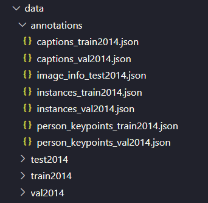

# Image Captioning

A deep learning model with a pretrained ResNet encoder to extract features of an image and an LSTM decoder to translates these features into a natural sentence that describes the image. The caption generation step is a beam search over a number of likely sentences to find the sentence with maximum probability.

## Overview

In this experiment, I implemented the LSTM decoder for an image captioning neural network, as described in the [Show and Tell: A Neural Image Caption Generator](https://arxiv.org/pdf/1411.4555) paper. I also implemented the beam search for image caption generation, so that this sampling task can consider a number of sentences simmultaneously and keep track of their probabilities, with the standard beam search algorithm as often seen in language models.

The experiment stemmed from the [image captioning project](https://github.com/udacity/CVND---Image-Captioning-Project/tree/master) in a course on Udacity, which provided the starting code, data processing classes and basic training steps that I have built upon here.

The model was trained on the [MS COCO dataset](https://cocodataset.org/#download), a large scale dataset of images and associated captions. The code here relied on the COCO API to access images and captions. Please follow the instructions [here](https://github.com/udacity/CVND---Image-Captioning-Project/tree/master) to download the `pycocotools` library to access COCO dataset.

The model was surprisingly effective after just one epoch of training (which took about 6-8 hours on a T4 GPU on Google Cloud) and could generate coherent and relevant captions for more than half of the test images. ResNet indeed was a powerful CNN able to extract rich and informative features, having been trained on massive previous dataset. Meanwhile, the LSTM decoder served well in modeling natural language and capturing the grammatical dependencies between words or the semantic connections with the input images.

## Training

### Requirements
```
matplotlib==3.8.4
nltk==3.8.1
numpy==1.26.4
Pillow==10.3.0
pycocotools==2.0.7
torch==2.3.0
torchvision==0.18.0
tqdm==4.66.4

```

### Scripts
```
python train_sketch_rnn.py --data_path=/path/to/data/folder --folder_path=/path/to/folder/to/be/created/for/training
```
Run `train_image_captioning.py` to launch training. Two arguments are required: (1) the path to the input data folder and (2) the path to the folder where module checkpoints and TensorBoard training stats will be saved.

The `--data-path` argument should point to a folder that should have this structure of the `data` folder in this screenshot, following the download instructions [here](https://github.com/udacity/CVND---Image-Captioning-Project/tree/master).



The resulting folder will have this structure, where subfolder names can be specified with arguments passed into `train_image_captioning.py`.


During training, live loss and perplexity curves and training stats, including average gradient values for each layer, can be viewed by running: ``` tensorboard --logdir /FOLDER_PATH/TENSORBOARD_FOLDER_NAME``` (see below for more details).

```
usage: train_image_captioning.py [-h] --data_path DATA_PATH --folder_path FOLDER_PATH [--lr LR] [--batch_size 8-2048]
                                 [--embed_size 64-2048] [--decoder_lstm_hidden_size 64-2048] [--num_epochs NUM_EPOCHS]
                                 [--log_file LOG_FILE] [--save_every_n_epochs SAVE_EVERY_N_EPOCHS]
                                 [--print_every_n_batches PRINT_EVERY_N_BATCHES] [--vocab_threshold 3-20]
                                 [--vocab_from_file] [--vocab_file_path VOCAB_FILE_PATH]
                                 [--optimizer_func {adam,rmsprop,sgd}] [--encoder_folder_name ENCODER_FOLDER_NAME]
                                 [--decoder_folder_name DECODER_FOLDER_NAME]
                                 [--tensorboard_folder_name TENSORBOARD_FOLDER_NAME]
                                 [--load_encoder_checkpoint_file LOAD_ENCODER_CHECKPOINT_FILE]
                                 [--load_decoder_checkpoint_file LOAD_DECODER_CHECKPOINT_FILE]

Train image captioning model.

options:
  -h, --help            show this help message and exit
  --data_path DATA_PATH
                        Path to the training data - required.
  --folder_path FOLDER_PATH
                        Path to the folder for saving model checkpoints and logs (required).
  --lr LR               Learning rate for the optimizer (must be <= 2.0).
  --batch_size 8-2048   Batch size for training (default: 128, range: 8-2048)
  --embed_size 64-2048  Dimensionality of image and word embeddings (default: 256, range: 64-2048)
  --decoder_lstm_hidden_size 64-2048
                        Number of features in hidden state of LSTM decoder (default: 512, range: 64-2048)
  --num_epochs NUM_EPOCHS
                        Number of training epochs (default: 3)
  --log_file LOG_FILE   Name of file with saved training loss and perplexity within 'folder_path' (default:
                        training_log.txt)
  --save_every_n_epochs SAVE_EVERY_N_EPOCHS
                        Frequency of saving model weights (default: 1)
  --print_every_n_batches PRINT_EVERY_N_BATCHES
                        Frequency of printing a loss value (default: 100)
  --vocab_threshold 3-20
                        Threshold for creating a vocabulary from file. If a word's frequency is under this threshold, the
                        word would be tokenized into <unk>. This argument is ignored if '--vocab_from_file' is True(default:
                        5, range: 3-20)
  --vocab_from_file     Load vocabulary from existing vocab file (If True, '--vocab_file_path' must be specified; if False,
                        then new vocabulary file will be created as 'vocab.pkl'.) (default: False)
  --vocab_file_path VOCAB_FILE_PATH
                        Path to the pre-created vocabulary (.pkl) file. Required if --vocab-from-file is True
  --optimizer_func {adam,rmsprop,sgd}
                        Optimizer function (adam, rmsprop or sgd).
  --encoder_folder_name ENCODER_FOLDER_NAME
                        Folder name for saving encoder checkpoints (automatically saved inside 'folder_path') (default:
                        saved_encoders).
  --decoder_folder_name DECODER_FOLDER_NAME
                        Folder name for saving decoder checkpoints (automatically saved inside 'folder_path') (default:
                        saved_decoders).
  --tensorboard_folder_name TENSORBOARD_FOLDER_NAME
                        Folder name for TensorBoard logging (automatically saved inside 'folder_path') (default:
                        tensorboard_logging).
  --load_encoder_checkpoint_file LOAD_ENCODER_CHECKPOINT_FILE
                        Path to a pre-trained encoder checkpoint file (optional).
  --load_decoder_checkpoint_file LOAD_DECODER_CHECKPOINT_FILE
                        Path to a pre-trained decoder checkpoint file (optional).
```

## Generation
```
python generate.py --image_path ./exp5_embed_size256/test_images/test_NIC1.jpg \
--coco_test_data_folder /path/to/downloaded/coco/data/folder \
--vocab_file_path ./exp_embed_size256/vocab.pkl \
--saved_encoder_path ./exp5_embed_size256/saved_encoders/encoder-1.pkl \
--saved_decoder_path ./exp5_embed_size256/saved_decoders/decoder-1.pkl \
--beam_width 4
```
The example command above runs `generation.py` on my own image (`--image_path`), using the trained encoder and decoder saved at the specified paths. The arguments `--coco_test_data_folder` (referring to the `data` folder containing the COCO dataset as structured above) and `--vocab_file_path` (the .pkl vocabulary file generated during training) are also required. These files are provided here for reference, except for the COCO dataset folder.

```
usage: generate.py [-h] [--image_path IMAGE_PATH] --coco_test_data_folder COCO_TEST_DATA_FOLDER
                   [--output_image_folder OUTPUT_IMAGE_FOLDER] --saved_encoder_path SAVED_ENCODER_PATH
                   --saved_decoder_path SAVED_DECODER_PATH --vocab_file_path VOCAB_FILE_PATH
                   [--beam_width BEAM_WIDTH] [--max_generation_len MAX_GENERATION_LEN]

Generate captions for an image.

options:
  -h, --help            show this help message and exit
  --image_path IMAGE_PATH
                        Path to the image to generate captions for. (If this is specified, --output_image_folder
                        is ignored.)
  --coco_test_data_folder COCO_TEST_DATA_FOLDER
                        Path to the COCO test data folder. Even when user provides an image, this argument is
                        still needed because the vocabulary file still needs to be loaded with a test loader
  --output_image_folder OUTPUT_IMAGE_FOLDER
                        Path to the folder to save the random test image.
  --saved_encoder_path SAVED_ENCODER_PATH
                        Path to the saved encoder model.
  --saved_decoder_path SAVED_DECODER_PATH
                        Path to the saved decoder model.
  --vocab_file_path VOCAB_FILE_PATH
                        Path to the vocabulary file.
  --beam_width BEAM_WIDTH
                        Beam search width (default: 5, range: 1-50).
  --max_generation_len MAX_GENERATION_LEN
                        Maximum generation length (default: 20, range: 5-50).
```

## Results

Training loss & perplexity curve after a certain number of batches:
<figure>
  
  
</figure>

The model gave coherent and relevant captions for more than half of the images after being trained for just one epoch. When the time and computing resources allow, I plan to experiment with training for more epochs and implement quantitative measures to assess the model's generated captions against human-written captions, as done in the original paper.

### Images from COCO dataset

<table>
  <tr>
    <td></td>
    </tr>
  <tr>
    <td tyle="text-align: center;">Generated captions: 

   1. a group of people walking down a sidewalk . 
   2. a police officer rides a motorcycle down the street . 
   3. a police officer rides a motorcycle down a street . 
   4. a group of people standing next to each other . 
   5. a group of people standing next to each other on a street . </td>
  </tr>
</table>

<table>
  <tr>
    <td></td>
    </tr>
  <tr>
    <td tyle="text-align: center;">Generated captions: 

   1. a baseball player swinging a baseball bat . 
   2. a baseball player holding a baseball bat . 
   3. a baseball player swinging a bat on a field . 
   4. a baseball player swinging a bat at a ball . 
   5. a baseball player swinging a baseball bat at a ball . </td>
  </tr>
</table>

<table>
  <tr>
    <td></td>
    </tr>
  <tr>
    <td tyle="text-align: center;">Generated captions: 

   1. a living room filled with furniture and a fire place . 
   2. a living room filled with furniture and a fireplace . 
   3. a living room filled with furniture and a window . 
   4. a living room with a couch and a tv 
   5. a living room filled with furniture and a fire oven .  </td>
  </tr>
</table>

<table>
  <tr>
    <td></td>
    </tr>
  <tr>
    <td tyle="text-align: center;">Generated captions: 

   1. a person riding a horse in a field . 
   2. a man riding a horse in a field . 
   3. a person riding a horse in a field 
   4. a man riding a horse in a corral . 
   5. a person riding a horse in a corral . </td>
  </tr>
</table>

<table>
  <tr>
    <td></td>
    </tr>
  <tr>
    <td tyle="text-align: center;">Generated captions: 

   1. a tennis player swinging a racket at a ball . 
   2. a man holding a tennis racquet on a court . 
   3. a man holding a tennis racquet on a tennis court . 
   4. a tennis player swinging a racket on a court . 
   5. a tennis player swinging a racket at a ball </td>
  </tr>
</table>

<table>
  <tr>
    <td></td>
    </tr>
  <tr>
    <td tyle="text-align: center;">Generated captions: 

   1. a man riding a wave on top of a surfboard .
   2. a surfer riding a wave in the ocean .
   3. a surfer riding the crest of a wave .
   4. a man riding a wave on a surfboard .
   5. a person riding a surf board on a wave .</td>
  </tr>
</table>

<table>
  <tr>
    <td></td>
    </tr>
  <tr>
    <td tyle="text-align: center;">Generated captions: 

   1. a table topped with plates of food and drinks . 
   2. a table topped with plates of food and drinks 
   3. a table topped with a plate of food and a cup of coffee . 
   4. a table topped with a glass of wine and a glass of wine . 
   5. a couple of people sitting at a table with a plate of food . </td>
  </tr>
</table>

<table>
  <tr>
    <td></td>
    </tr>
  <tr>
    <td tyle="text-align: center;">Generated captions: 

   1. a man flying through the air while riding a skateboard .
   2. a man flying a kite on the beach .
   3. a man flying through the air while riding his skateboard .
   4. a man flying a kite in the sky .
   5. a man flying through the air on a skateboard .</td>
  </tr>
</table>

<table>
  <tr>
    <td></td>
    </tr>
  <tr>
    <td tyle="text-align: center;">Generated captions: 

   1. a wooden bench sitting next to a tree . 
   2. a wooden bench sitting in a park . 
   3. a wooden bench sitting in front of a building . 
   4. a wooden bench sitting in front of a window . 
   5. a wooden bench sitting in front of a house . </td>
  </tr>
</table>

### My own images

<table>
  <tr>
    <td></td>
    </tr>
  <tr>
    <td tyle="text-align: center;">Generated captions: 

   1. a cat sitting on top of a suitcase . 
   2. a cat sitting on top of a bed . 
   3. a cat sleeping on a blanket on a bed . 
   4. a cat sleeping on a blanket on a bed 
   5. a cat sitting on top of a couch next to a laptop .  </td>
  </tr>
</table>

<table>
  <tr>
    <td></td>
    </tr>
  <tr>
    <td tyle="text-align: center;">Generated captions: 

   1. a vase filled with lots of purple flowers . 
   2. a vase filled with purple flowers in a vase . 
   3. a vase filled with purple flowers in a glass vase . 
   4. a vase filled with purple flowers in a glass holder . 
   5. a vase filled with flowers and a glass of water .   </td>
  </tr>
</table>

### Inaccurate captions

<table>
  <tr>
    <td></td>
    </tr>
  <tr>
    <td tyle="text-align: center;">Generated captions: 

   1. a man wearing a tie and a shirt . 
   2. a man wearing a tie and a shirt 
   3. a man wearing a tie and a red shirt . 
   4. a man and a woman sitting on a couch . 
   5. a man and a woman sitting on a bench . </td>
  </tr>
</table>

<table>
  <tr>
    <td></td>
    </tr>
  <tr>
    <td tyle="text-align: center;">Generated captions: 

   1. a desk with two computers on it . 
   2. a desk with two computers and a glass of wine . 
   3. a desk with two computers and a glass of wine 
   4. a desk with a keyboard , a monitor , and a laptop . 
   5. a desk with a keyboard , a monitor , and a glass of wine . </td>
  </tr>
</table>

<table>
  <tr>
    <td></td>
    </tr>
  <tr>
    <td tyle="text-align: center;">Generated captions: 

   1. a close up of a keyboard on a desk 
   2. a close up of a keyboard on a table 
   3. a close up of a remote control on a table 
   4. a close up of a piece of paper on a table 
   5. a close up of a piece of paper on a desk </td>
  </tr>
</table>

## Network Diagram

This network diagram came from the original [Udacity GitHub](https://github.com/udacity/CVND---Image-Captioning-Project/tree/master) of the project.

